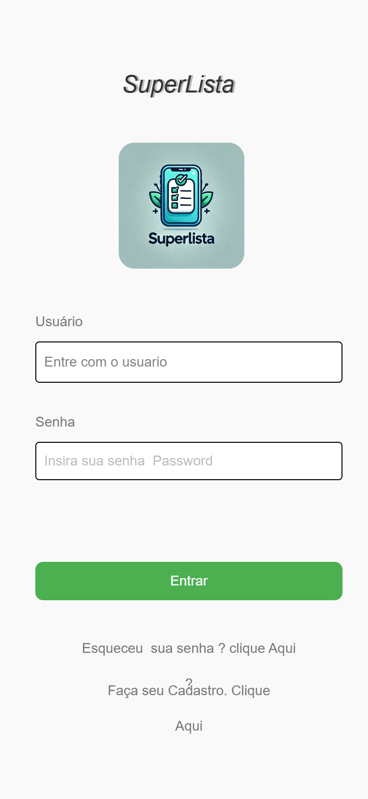

# 📄 Projeto: SuperLista

## 📌 Objetivo do Projeto
O aplicativo **SuperLista** tem como objetivo facilitar a organização das compras de supermercado e itens essenciais para casa.  
Ele permite que os usuários criem listas práticas, adicionem itens, controlem o que já foi comprado e o que ainda falta, otimizando tempo e evitando esquecimentos durante as compras.

## 🛠️ Funcionalidades
- Criar e editar listas de compras.
- Adicionar, editar e remover itens da lista.
- Marcar itens como "comprados" ou "pendentes".
- Salvar múltiplas listas (ex.: "Compras do Mês", "Festa", "Viagem").
- Visualização clara e intuitiva das listas.

## 🎯 Público-Alvo
- Pessoas que fazem compras regularmente.
- Famílias que precisam organizar as compras do mês.
- Estudantes e pessoas que moram sozinhas e querem otimizar suas despesas.

## 🎨 Paleta de Cores e Estilo Visual
O visual do aplicativo foi pensado para transmitir organização, praticidade e leveza, utilizando cores que não causem estresse visual.

| Elemento | Cor | Justificativa |
|:---|:---|:---|
| **Background geral** | `#F9F9F9` (cinza claro) | Sensação de limpeza e simplicidade. |
| **Elementos ativos (botões, destaques)** | `#4CAF50` (verde) | Representa "concluído" e "positivo". |
| **Texto principal** | `#333333` (cinza escuro) | Melhor legibilidade. |
| **Texto secundário** | `#777777` (cinza médio) | Informações complementares. |
| **Itens marcados como comprados** | `#A5D6A7` (verde claro) | Visualização rápida de itens comprados. |

## 🖼️ Background do App
O fundo do app será limpo (`#F9F9F9`) para manter o foco nos itens da lista, evitando poluição visual.  
Em telas específicas (como o resumo de compras concluídas), pode-se utilizar um leve padrão ou imagem discreta relacionada a mercados ou cestas de compras, sempre mantendo a sobriedade.

## 🧩 Tecnologias Utilizadas
- **Frontend:** React Native
- **Gerenciamento de Estado:** Provider / Riverpod / Redux (especifique)
- **Backend:** LocalStorage / Firebase / API própria
- **Banco de Dados:** SQLite / Firebase Firestore
- **Outros Recursos:** Notificações locais para lembretes de compras.

## 🖼 Telas do Aplicativo

  
  
  

## 📈 Roadmap Futuro
- [ ] Adicionar login de usuário.
- [ ] Compartilhar listas com outros usuários.
- [ ] Notificações de lembrete de compra.
- [ ] Estatísticas de gastos mensais.

## 📋 Versão Atual
- **Versão:** 1.0.0
- **Data de Lançamento:** (definir)

---

> Desenvolvido com ❤️ para facilitar a vida nas compras do dia a dia.
